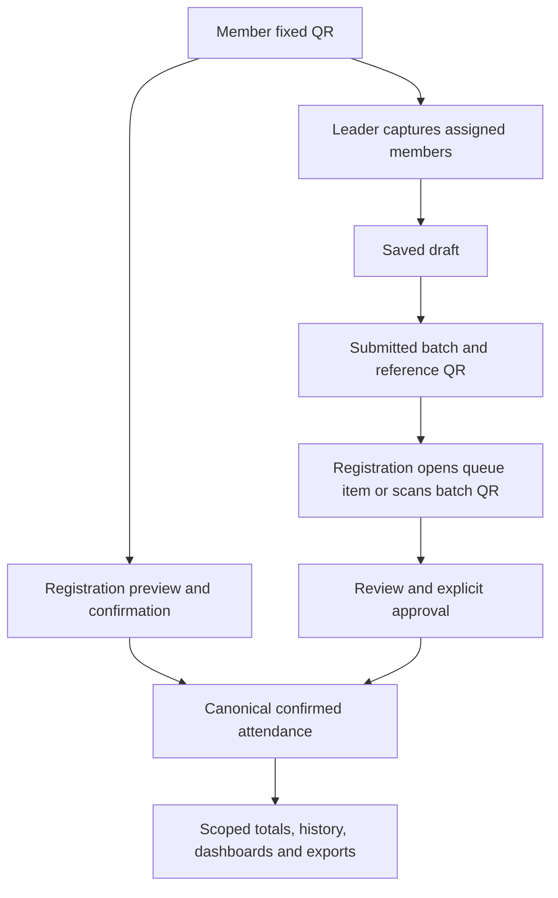

# QR Attendance and Unified Leadership Improvement Plan

Prepared: 7 October 2026
Source baseline: main, commit 576d5dc83ba2de4ccf172f8b8a08cf085c704c76

Revision 2 expands the plan to complete attendance experiences for all affected modules, explicit Pastor attendance views, responsive user journeys, and one Leader role with Admin-designated cell-group, group, or both assignments. Sections 15–19 define the expanded architecture and combined execution order; the core QR phases remain detailed work packages within that roadmap.

## 1. Purpose, evidence, and completion goal

Improve attendance for Services and Events across Members, Cell Group Leaders, Group Leaders, Registration Team, System Admin, Pastor, and Ministry Leaders. Preserve the approved design: a reusable member QR, saved leader drafts, a QR referring to a submitted batch, explicit registration approval, and one confirmed attendance record for each applicable attendance unit.

The target leadership model replaces the two operational role choices with **Leader**. System Admin assigns a cell group, a group, or both. Those assignments determine available roster, attendance and related capabilities. Cell groups and groups remain separate entities, and Ministry Leader remains a separate role. Existing leader accounts continue to work during a staged migration.

The local QR worktree and the GitHub main reference were compared and matched at the commit above. This review inspected current frontend entry points, scanner and dialog behavior, API routes and validation, permissions and leader scope, session and batch lifecycle, model definitions and migration constraints, attendance writers, summaries, exports, member history, notifications, rate limits, CI, and deployment configuration.

**Evidence boundary:** The findings below are source observations and failure scenarios to reproduce. No new database audit, browser role test, performance benchmark, migration, production write, or runtime repair was performed for this planning deliverable. Existing verification reports document earlier release checks; their test counts and initial-release status must not be presented as checks newly performed here.

**Completion goal:** An operator can select the intended activity and assigned team, scan repeatedly without restarting the camera, recover safely from a failed or uncertain save, and see correct saved status. Leaders with cell-group, group, or both assignments can use their complete permitted roster and attendance flows, resume drafts, submit and correct batches, and receive approval outcomes. Registration can process a complete, current queue. Pastor has a functional church attendance overview and drilldowns. Role-scoped lists, totals, member history, and exports agree under duplicate scans, membership changes, corrections, and delayed approval. Every affected screen and required control must complete its permitted journey on phones, tablets and desktops. The release must pass real browser-to-API-to-database verification using synthetic QA fixtures and the expanded gates in sections 16–19.

## 2. Current integrated module map

### 2.1 Screens, services, and adjacent modules

| Surface or component | Current responsibility | Integration point for improvement |
| --- | --- | --- |
| MemberPortal.jsx, Attendance section | Fixed QR entry; Service history and rate; Event history fetched separately | Prominent My QR shortcut, sorted/paged combined history, personal pending/confirmed status |
| MemberQrPanel.jsx | Issue once, display current QR, download PNG, print | Reuse a single modal from Overview and Attendance; show version and replacement guidance |
| MemberProfilePage.jsx / OperationalMemberQrPanel.jsx | Admin/Registration issue and reasoned reissue | Recovery for an unlinked account or unavailable QR; idempotent reissue |
| AttendanceOverviewPage.jsx | Recent Services and attendance lookup | Session status and canonical attendance metrics |
| AttendancePage.jsx at /services/:id/attendance | Legacy attendance sheet and QR workspace link | Shared metrics and clear routing to the configured attendance mode |
| EventDetailPage.jsx | Event registrations and QR workspace link | Separate registered, confirmed, awaiting approval, and session participation |
| /attendance/qr / QrAttendanceWorkspace.jsx | Session setup, member preview/confirmation, leader draft, review queue, corrections, CSV | Split into focused role components and scoped data hooks |
| QrScannerDialog.jsx / useQrDialogFocus.js | Lazy ZXing camera/image decoding and accessible modal focus | Persistent camera, scan acknowledgement state, stable capture context, cleanup |
| QR routes / validators / policy | Authentication, permission checks, payload validation, capture window, registration requirement | Dedicated query contracts and explicit recovery outcomes |
| memberQr.service.js / qrPayload.js | Active member credentials, issue/reissue, opaque versioned payloads | Maintain fixed identity; reliable operation receipts for replacement |
| sessions.service.js | Parent activity, one Service session, multiple Event session keys, expected roster, open/close/cancel | Correct snapshot opening, setup defaults, draft edits, audited window changes, reconciliation |
| batches.service.js | Scoped draft ownership, revisions, submission digest, atomic approval, duplicate receipts | Resume/correct drafts, bulk recording, live queue, pre-approval issue preview |
| attendanceWriter.js / attendance.controller.js | Canonical attendance persistence, preview, list, corrections, export | Authoritative save acknowledgement and consistent scoped reads |
| summary.service.js / attendanceSummary.helper.js | QR metrics and legacy Service summary | Shared metric definitions; capacity separated from expected attendance |
| dashboard.service.js / member-portal.service.js | Registration Service trends and member Service attendance rate/history | Event-aware, scoped attendance data with explicit denominator definitions |
| Notification model/service / Header.jsx | Per-user in-app notices and known reference links | QR batch notices and exact session/batch deep links |
| UsersPage.jsx / UserFormPage.jsx / users.service.js | One role and role-specific leader fields; the other leader field is cleared | Unified Leader choice, independent Admin assignment controls and atomic assignment updates |
| Auth session DTO / roleAccess.js / roleDisplay.js / MainLayout.jsx | Singular leader fields, role-name route/tab/display rules | Additive assignment collection, context-aware capabilities, access revision and navigation |
| featureSettings.js / legacyWriteGuard.js | Global enablement, optional-schema readiness, legacy write restrictions | Preserve batch rules during feature disablement and support additive capability versions |
| .github/workflows/ci.yml / QR fixture scripts | Fresh MySQL migration, API integration, upload browser flow, fake-camera startup | Failure, concurrency, pagination, and actual camera-frame decode coverage |
| Vercel / Render / TiDB configuration | Vercel SPA/API rewrite, Render API on main, Sequelize MySQL dialect | Backend-first compatible deployment, additive migrations, controlled enablement |

The frontend already has a QueryClientProvider and TanStack React Query. The improvement should use that provider for QR queries and scoped invalidation. The current notification table and header should provide the initial in-app handoff. The application remains on its existing React/Vite, Express, Sequelize/TiDB, Vercel, and Render stack.

### 2.2 Data ownership and uniqueness

| Store | Meaning and current key | Required invariant |
| --- | --- | --- |
| member_qr_credentials | Opaque public UUID; unique member/version; active/revoked history | At most one active credential per member through the locked issue/reissue service |
| attendance_sessions | Unique service_id; unique event_id/session_key | Service keeps one attendance session; Event can contain distinct attendance sessions |
| attendance_expected_members | Unique session_id/member_id; group snapshots when frozen | Expected roster is a denominator with an explicit basis |
| attendance_batches | Public UUID, owner, group, state, revision, digest; unique owner/idempotency key | Draft mutable; submitted attendee list immutable; review checks revision/digest |
| attendance_batch_items | Unique batch_id/member_id; capture method, time, actor, group snapshots | Capture facts survive approval, duplicate handling, and batch correction history |
| user_leader_assignments | Existing normalized table; user_id, typed scope_type, scope_id, legacy_column, assigned_by; unique user/type/scope and team lookup indexes | Already backfilled from legacy leader fields; promote this table to the runtime source for Leader scopes |
| attendances | Existing Service ledger; unique service_id/member_id; QR provenance and void fields | One confirmed Service check-in; RSVP pre-reg becomes attendance only after confirmation |
| event_attendances | Unique session_id/member_id; direct/batch provenance and correction version | One confirmed Event-session check-in |
| service_attendance_summary | Materialized legacy counts; expected currently derives from Service capacity | Treat materialized values as a projection; expose the metric basis |
| audit_logs | Issue/reissue, lifecycle, recording, approval, and correction actions | Attendance and its essential audit records commit together |
| notifications | User-specific message and reference | Notices follow a committed state change and cannot expand access |

A batch QR carries **MCC:BATCH:1:public-UUID**, not its attendee list. A member QR carries **MCC:MEMBER:1:public-UUID**, not a password or session token. The server resolves both under the operator's current permissions.

Do not convert Services to multiple sessions by removing their unique key: Service attendance is keyed by service_id, not session_id. Recurring Service occurrences remain separate Service records. Event reporting must distinguish unique participants across the event from the sum of session attendance.

### 2.3 Current flow and state machines

| Entity | Allowed current transitions | Improvement |
| --- | --- | --- |
| Session | draft → open → closed; draft/open → cancelled | Keep capture state separate from review/reconciliation state |
| Batch | draft → submitted → approved/rejected; draft/submitted → withdrawn | Add correction as a new linked draft; retain rejected/withdrawn source |
| Credential | active → revoked, followed by a new active version | Reissue receipt prevents accidental repeated replacements |
| Attendance | confirmed → voided → reinstated through reasoned version checks | Confirmed counts exclude voids; preserve correction history |

### 2.4 Current role boundaries before unification

| Role | Current operational access | Intended improved experience |
| --- | --- | --- |
| Member | Authenticated personal QR/history through linked member profile; no default QR operational read grant | One-tap QR and own attendance status/history |
| Cell Group Leader | Assigned cell-group roster/attendance; own drafts, submission and withdrawal | Assigned roster, saved indicators, draft resume and correction |
| Group Leader | Assigned group roster/attendance; own drafts, submission and withdrawal | Same workflow within the assigned group |
| Registration Team | Session configuration, individual confirmation, batch review, corrections and QR management | Fast scanner, current review queue, reconciliation and recovery |
| System Admin | Global management and confirmation/review/correction permissions | Session setup, exception recovery, diagnostics and oversight |
| Pastor | QR read access without capture/review privileges | Church attendance overview with clear metric definitions |
| Ministry Leader | QR read access scoped through current ministry membership; no batch-review grant | Assigned-ministry attendance view; label current membership basis |
| Finance Team | No default QR operational grant | Preserve existing finance workflows and authorized navigation |

Admin's permission seed includes batch actions, but batch creation still requires an assigned Cell Group or Group Leader domain scope. The UI must follow the actual domain capability; do not create an unscoped administrative batch path implicitly. New/custom roles require explicit scope rules before operational attendance access.

## 3. Finding register and implications

Source anchors below refer to the baseline commit. Line numbers will change during implementation.

| ID | Priority | Observation and consequence | Source anchor |
| --- | --- | --- | --- |
| F01 | P1 | Frontend sends batch state; the shared query schema accepts status and stripUnknown removes state. The service expects state. Filtering is unreliable. This corrects the earlier preliminary claim that history necessarily contains only submitted rows. | Workspace:121–126; validators:72; validateQuery:6; batches:357 |
| F02 | P0 | Explicit expected members are inserted during draft setup. Opening reads those rows and bulk-inserts them again against a unique session/member key. Source indicates a duplicate-key failure path requiring DB reproduction. | sessions:37–101,168–217,239; QR migration:183–185 |
| F03 | P1 | Summary uses captured/frozen group snapshots; attendance lists and CSV join current membership. A transfer can change who appears in a list without changing its summary. | summary:18,90–158; controller:122,377 |
| F04 | P1 | Registration/RSVP totals are global even when confirmed and expected totals are leader-scoped. | summary:179–195 |
| F05 | P1 | Pending members are distinct within submitted batches but are not reconciled against confirmed attendance. An already checked-in person can still inflate the pending card. | summary:45–88 |
| F06 | P1 | Absence becomes available on closure/time expiry while batch review can continue until its deadline. Pending physical captures can look like finalized absence. | summary:177–194; batches:255–259,455–470 |
| F07 | P1 | Legacy Service expected/absent totals use capacity. Seats and expected people are different concepts. | attendanceSummary.helper:29–35 |
| F08 | P1 | A member scan stops the camera and closes the dialog; confirmation performs preview, write, then at least four reload requests. | scanner:81–90; Workspace:106–173,380–419 |
| F09 | P1 | Async session loads/previews have no request-generation protection. A delayed response can populate state after a session switch. | Workspace:96–173,197–219,380–405 |
| F10 | P1 | The batch API defaults to 50 rows; the frontend does not use returned total/page or provide batch pagination. Newest-first ordering can hide older submissions. | batches:357–405; Workspace:126,679–684,758–765 |
| F11 | P1 | Cross-device submission/approval has no QR polling or QR notification handoff. Other screens can remain stale until a reload or local action. | Workspace effects; QR batch lifecycle; Header:134–165 |
| F12 | P1 | QR attendance commits before Service summary synchronization. A later projection failure can return an error although attendance is already saved. | controller:173–221; batches:623–641 |
| F13 | P1 | Each draft-create click uses a new request UUID. Multiple drafts can exist while the workspace selects only one. | Workspace:135–143,312–320; batches:76–130 |
| F14 | P1 | Rejected batches cannot be corrected through a linked revision workflow; supersedes_batch_id exists but is unused. New draft creation requires an open session, limiting correction after closure. | models:93; batches:76–130,328–355 |
| F15 | P1 | Manual roster lookup is restricted to frozen expected IDs, while direct QR validation accepts live registrations. A registration made after opening can work by QR and fail to appear in manual search. | sessions:335–346; policy:57–69 |
| F16 | P1 | Dates default to offsets from the current browser time, not the parent schedule; display uses browser-local formatting beside an Asia/Manila label. | Workspace:9–25,540,595 |
| F17 | P2 | Summaries fetch complete attendance and expected-ID sets and group them in application memory; batch approval writes items sequentially while locking the session. Growth risk needs measurement. | summary:111–176; batches:475–597 |
| F18 | P1 | All QR calls share 120 requests/user/minute and 300/network/minute. Six requests per direct check-in can throttle normal activity at several desks; polling adds traffic. | rateLimiters:16–35; Workspace confirmation reload |
| F19 | P2 | Service/Event member histories are unbounded; combined UI concatenates the two arrays instead of globally sorting them. The member rate is Service-only. | memberQr.service:142–178; member-portal.service:99–162; MemberPortal:588–609 |
| F20 | P1 | Disabling the QR setting causes the legacy write guard to return early, which can permit direct legacy recording for a previously configured batch-review activity. | legacyWriteGuard:15–16 |
| F21 | P1 | Operational attendance/CSV can include voided rows but label the collection confirmed; CSV omits void status, confirmation actor/time and batch receipt references. | controller:117–153,373–416; Workspace:733–748 |
| F22 | P2 | Camera E2E proves stream startup; uploaded-image E2E proves decoding/persistence. The live-camera test does not yet decode QR-bearing camera frames through persistence. | qr-attendance-browser-e2e:160–175,265–268 |

P0 means a core supported path should be reproduced and repaired first. P1 means correctness, user recovery, or normal operational throughput. P2 means scale, usability, or additional verification. These labels prioritize work; they are not claims of new live incidents.

## 4. Recommended operating rules

1. Member QR stays fixed until an authorized, reasoned reissue. Previously confirmed attendance remains intact after replacement.
2. Select and visibly lock the exact activity/session during scanning, confirmation, and batch review. Client intent stores its session ID; the server validates it.
3. Staff confirm a direct check-in after viewing identity. Leaders save capture into their own draft. Decode alone never confirms presence.
4. QR type detection may select the matching member/batch preview automatically; backend permissions and explicit confirmation remain authoritative.
5. Service uniqueness is service/member; Event uniqueness is session/member. A second route preserves the first confirmation's provenance.
6. Current assigned team controls permission to capture. A Leader with both assignments selects one explicit cell-group or group context for a batch or membership mutation; All assignments is a read-only union. Saved group snapshots control historical attribution. Legacy rows without snapshots use a labelled current-membership fallback.
7. Historical expected-roster membership and capture-time attribution are different facts. A member who transfers after roster freeze may attend through another group: expected-member presence checks the permitted frozen member IDs against canonical confirmation, while attribution reports the captured group. Show a transfer explanation rather than force the numbers to match.
8. Ministry history currently has no ministry-at-capture snapshot. Label ministry views as current assigned members; do not imply immutable historical ministry attribution.
9. Expected roster is a frozen denominator, not automatically a ban on other attendees. Registration-required Events still validate actual registration at capture. Late registrants remain discoverable by manual search and QR; count them outside the frozen expected set unless an explicit audited roster adjustment is introduced later.
10. QR reissue, registration changes, or group transfer after a valid capture do not silently erase that capture. Review identifies relevant changes; correction requires an authorized action and reason. A valid member's status such as Inactive is informational unless an explicit attendance eligibility policy requires otherwise.
11. Pending drafts are not confirmed. Submitted pending totals count unique people still needing confirmation, with duplicate/already-confirmed items shown separately.
12. Close stops capture. Review and reconciliation continue separately. Missing and awaiting approval are provisional until expected-roster attendance is reconciled; finalized absence requires resolution of outstanding submissions or explicit recorded expiry decisions.
13. Late approval retains the existing permission requirement and recorded reason. Any late approval/correction after finalization reopens reconciliation and preserves the prior finalization audit.
14. Batch size remains 200. Bulk manual recording initially accepts at most 50 deliberately selected people per request. Selection never defaults to the whole group.
15. A rejected/withdrawn batch is corrected through a new linked draft and new batch QR. Approved submissions cannot be edited. After capture closes, revision may remove/correct saved entries but cannot fabricate new arrival times.
16. Capacity describes available space; an attendance-session rate uses an identified expected set. With no expected set, session expected/absent/rate are unavailable rather than inferred from capacity. The existing personal completed-Service rate has its separate, explicitly labelled denominator.
17. A failed refresh after a confirmed save shows saved plus totals updating. An uncertain write shows checking save status; it must not show confirmed or unsaved until the outcome is established.
18. Feature disablement preserves the mode of already configured activities. Authorized history and committed-receipt reads remain available when recording is paused. Emergency fallback is an explicit, audited operational choice using authorized staff, not an automatic leader approval bypass.

## 5. Target user experience

| Workflow | Intended steps and visible acknowledgement |
| --- | --- |
| Member | Overview → My QR → show saved/printed code; Attendance shows pending approval or confirmed with activity and session |
| Registration direct | Open active session → Start camera once → identity preview → Confirm → saved/already confirmed result → next scan |
| Leader | Open assigned roster → Resume draft → scan or select physically present members → server-saved badge → Review roster → Submit |
| Batch handoff | Submission appears in queue and notifies eligible staff; QR remains available for physical handoff; either path opens the same saved submission |
| Registration review | Open oldest waiting batch → view new/duplicate/conflicting entries → Approve or reject with reason → persisted receipt and next batch |
| Rejected batch | Leader opens reason → creates linked correction → adjusts permitted saved entries → resubmits → registration reviews a new immutable submission |
| Correction | Authorized operator opens record → reasoned void/reinstate with current version → totals/history update; reconciliation is reopened when needed |
| Finalization | Staff review unsubmitted drafts and pending/overdue batches → resolve them → finalize expected-roster outcomes → export reconciled report |

Use plain status text and icons, with color as a secondary cue. On phones, scan controls and the current activity stay visible; rosters/review use cards rather than forcing wide tables. Focus, keyboard confirmation, Escape cleanup, readable errors, and existing English/Tagalog member text remain part of the UI contract.

## 6. Implementation phases and gates

### Phase 0 — Establish reproducible baseline and contracts

**Work**
- Reproduce F01/F02/F03/F06/F12/F15 using small guarded QA fixtures: explicit roster opening, submitted/approved filters, a transferred member, close with pending approval, failed projection after commit, and registration after opening.
- Record the browser/API/database result separately for each scenario. Capture request counts and warm timings for direct scan and 200-item approval.
- Inventory existing data shapes and indexes on the isolated QA schema; confirm the source migration's enum/model differences without changing a deployed table.
- Write metric definitions, role scope, and error response examples before implementation.
- Establish a clean implementation branch from the verified main baseline using the existing suitable QR worktree. Preserve the unrelated dirty migration worktree.

**Gate:** Reproducible fixtures, expected outcomes, and a traceable finding-to-test map. No unexplained discrepancy may be classified as already repaired.

### Phase 1 — Repair data correctness and save recovery

**Work**
- Split session, batch, roster, attendance, and history query schemas. Make state canonical for batches; accept status as a temporary alias, reject contradictory aliases, and preserve existing response fields.
- Fix explicit-roster opening by freezing/updating the existing draft rows once. Registration-derived opening inserts only missing rows; opening is serialized and cannot duplicate expected members.
- Create a shared attendance read policy used by summary, lists, exports and history. Define captured, frozen, current-ministry and legacy-fallback attribution explicitly.
- Make the policy accept a validated assignment context or permitted read union. Missing/unknown Leader scope must deny access; authorization predicates must remain separate from search/filter predicates.
- Scope registration totals, exclude confirmed duplicates from actionable pending totals, and separate capacity, expected people and provisional absence.
- Make active attendance and correction history separate filters. Default attendance/export to active confirmed rows; history exports include correction status and provenance.
- Return an authoritative committed result independently of optional summary refresh. Handle projection failures with structured pending-refresh status and repair on subsequent reads; prevent an older projection from overwriting a newer one.
- Introduce client operation IDs/receipts for new recovery-sensitive mutations, especially reissue and bulk capture. Reuse batch draft idempotency and attendance unique keys. Same operation ID with different intent is a conflict.
- Preserve configured batch-review rules when the global QR switch changes.

**Affected source:** validators.js, routes.js, sessions.service.js, scope.js, summary.service.js, attendance.controller.js, attendanceWriter.js, memberQr.service.js, attendanceSummary.helper.js, legacyWriteGuard.js.

**Gate:** Explicit roster opens correctly; scoped counts/list/export agree; duplicate/uncertain retry creates one fact; a projection failure cannot report a committed save as a failed write.

### Phase 2 — Stabilize workspace state and continuous scanning

**Work**
- Extract QR queries/mutations into hooks using the existing QueryClient. Keys include user, access revision, role, selected assignment context, target, session, filters and page.
- Split the workspace into session header/setup, direct scanner, leader draft, review queue, review detail, metrics and attendance history components. Keep the existing route usable throughout.
- Bind each preview/save to an immutable scan context and use AbortController plus request-generation checks for stale reads. Aborting a client write does not imply server rollback.
- Add scanner states: idle, starting, scanning, decoded, validating, ready, saving, saved, conflict, unavailable and outcome-unknown.
- Keep the video stream alive while preview/confirmation pauses decoding. Resume after acknowledgement or deliberate skip; stop all tracks on close, logout, navigation and camera switch.
- Suppress consecutive same-code frames while an operation is outstanding. Clear suppression on acknowledgement/explicit next scan, not solely on a timer.
- Patch acknowledged records into the correct query cache and refresh only necessary metrics. Preserve scroll, selected page, draft selections and review detail.
- Show name/photo when permitted, with a photo-unavailable fallback; display duplicate time/source. Retain upload and manual search as usable input paths.

**Affected source:** QrAttendanceWorkspace.jsx, QrScannerDialog.jsx, qrAttendance.css, useQrDialogFocus.js, QR hooks/components, role-flow tests.

**Gate:** Twenty sequential simulated-camera scans use one camera start; duplicate frames trigger one preview; session-switch races cannot render or confirm under a different activity; each save has an explicit outcome.

### Phase 3 — Complete session setup and lifecycle recovery

**Work**
- Prefill dates from service_date/service_time or event start/end fields. When Event duration/end time is absent, require a reviewed session end rather than inventing a precise schedule.
- Centralize UTC transport and Asia/Manila display/conversion. Validate time-zone identifiers and time ranges; expose server time and capture-window state so client clock drift does not open a session.
- Prefer the active session explicitly; list/paginate historical sessions and resolve an exact deep-linked ID directly rather than searching only the first page.
- Add versioned draft configuration edits and expected-roster listing/removal before opening. Confirm expected basis and dates when opening.
- Add audited window-extension handling for open sessions. It must not invalidate saved captures. Apply approval-deadline changes consistently to outstanding batches, bump affected revisions and require review refresh.
- Record actual manual capture closure separately from the scheduled deadline.
- Add explicit reconciliation/finalization with revision checks. Late approved attendance or corrections invalidate finalization and produce a new audit trail.
- Preserve one Service session and distinct Event session keys; cancelled activities stop capture and approval.

**Gate:** Correct dates across device time zones; editable draft setup; safe version conflicts; capture closes while valid saved batches remain reviewable; final absence has a recorded reconciliation basis.

### Phase 4 — Deliver current batch handoff and complete history

**Work**
- Separate Waiting, Approved, Rejected and Withdrawn history; paginate each. Order waiting batches by submission time, oldest first.
- Provide one compact scoped updates endpoint for summary, queue status and revisions. Poll initially every 15 seconds with jitter while visible/online; refresh on focus/reconnect; stop on logout/session change.
- Back off transient failure and rate limiting, respect Retry-After, and display last-updated/stale state. Do not run the four full workspace reads at each interval.
- Add per-user in-app notices for submission/review outcomes and exact session/batch references. Persist notices transactionally with deduplication; recipient resolution follows current permissions.
- Extend Header notification navigation for attendance_session/attendance_batch, preserving existing links.
- Preview current duplicates/conflicts before approval; commit revalidates revision, digest, session policy and available member references.
- Retain atomic whole-batch approval. An invalid record is identified for corrected submission; do not introduce silent partial approval.
- Two reviewers may open the same item; show an already-reviewed result when the second acts. A reviewer claim/lease is optional after measuring queue contention.

**Gate:** Two independent logged-in contexts see submission/approval within 20 seconds on a warm connection; histories exceed 50 rows without omissions; retries do not duplicate notices or attendance.

### Phase 5 — Improve leader roster and corrected submissions

**Work**
- Load a paged assigned roster without requiring repeated name searches; add search and saved/pending/confirmed filters. Registration eligibility and frozen expectation are separate badges.
- For the unified Leader, provide cell-group/group context selection, scope-specific capabilities and a read-only All assignments view. Persist each draft's exact origin scope; switching context cannot retarget a saved batch.
- Resume an existing draft, show other drafts/submissions explicitly, and retain a stable draft-create request ID until acknowledgement. Resolve concurrent creates under a lock.
- Add bulk capture of up to 50 selected members within the 200-member batch maximum. Validate every selected member and expected revision before committing the selection.
- Return added/duplicate counts, saved item details and the new revision; remove the full-batch GET after every add. Process live scanner additions serially per draft.
- Add a correction endpoint creating a new draft linked through supersedes_batch_id. Preserve source times/scope/actor for retained entries; issue a new public QR on submission.
- Support corrections after closure within review policy; additions of newly observed people still obey the capture window. Expose expired/overdue state without deleting saved records.
- Route orphaned batches after leader reassignment to authorized staff for documented recovery. Do not grant the former leader access to a new group's records.

**Gate:** Refresh resumes the correct draft; a 200-person roster can be processed in deliberate chunks; mixed valid/invalid selection has a clear atomic result; correction works after closure without changing original capture times.

### Phase 6 — Integrate personal history and reporting

**Work**
- Reuse the member QR modal from Overview and Attendance; keep downloaded/printed QR compatible and show replacement version guidance.
- Add an authenticated personal status/history endpoint with type/status/date filters and bounded pagination. It returns only the linked member, including permitted submitted-pending status.
- Globally sort combined Service/Event history; keep the Service-only rate clearly labelled until a separate Event participation metric is defined.
- Adapt Attendance Overview, Service sheet, Event details, Registration dashboard and read-only leadership views to common metric definitions.
- Implement the Pastor attendance dashboard, Services/Events period filters, session/group drilldowns, provisional/finalized status and permitted exports defined in section 16. An attendance link alone does not satisfy this requirement.
- Report event-wide unique participants separately from per-session visits. Treat cell-group and group breakdowns as separate dimensions; do not add them together.
- Include activity/session, status, capture and confirmation time/actor, source batch and export generation time/basis in appropriate scoped exports.
- Add validated date/status narrowing to exports. Keep the current 20,000-row guard until a measured, bounded paged/streamed export is implemented; exceeding the budget must offer a useful narrowing action rather than a broken download.
- Show unavailable metrics as unavailable with a reason instead of zero on query failure.

**Gate:** The same synthetic attendance produces consistent active totals and provenance in workspace, dashboard, history and CSV. Member/leader views reveal only permitted data.

### Phase 7 — Verify resilience, performance and release

**Work**
- Run the scenario matrix below against guarded MySQL CI and isolated TiDB QA; add focused tests tied to findings.
- Extend browser E2E with actual QR-bearing simulated webcam frames. The real ZXing callback must lead through preview, confirmation and persisted attendance. Keep image-upload E2E too.
- Exercise concurrent registration contexts, close/approve races, two leader tabs, network loss after commit, reissue races, and failed projection/notification paths.
- Compare EXPLAIN and request/query counts with representative QA data. Replace full attendance/expected sets with grouped SQL/joins where justified; optimize sequential approval while retaining its atomic result and provenance.
- Verify role navigation and representative existing login/session restore, incognito login, forced-password, logout, RSVP/registration, Services, Events, member profile and finance paths.
- Deploy compatible API/migrations first through main, verify readiness, deploy frontend, enable the enhanced flow, and inspect actual deployed browser/API behavior.

**Gate:** All mandatory scenarios pass; no unresolved P0/P1 issue; release evidence distinguishes CI MySQL, TiDB QA, deployed smoke and physical camera hardware.

## 7. Proposed API and schema changes

### 7.1 Backward-compatible API contracts

The existing routes and response properties remain accepted during rollout. New fields are additive; introduce separate validators rather than changing shared query behavior across unrelated modules.

| Route or contract | Planned addition |
| --- | --- |
| GET /sessions | Validated status/target filters and total/page metadata |
| GET /sessions/:id/batches | Canonical state filter; temporary status alias; pagination and queue/history ordering |
| GET /sessions/:id/roster | Assigned/eligible roster with own saved status; search/filters/page |
| GET /sessions/:id/updates | Small scoped update envelope with server time, revision, window/reconciliation status and queue/metric changes |
| POST /sessions/:id/check-ins | Optional client_operation_id; committed outcome, unchanged provenance for duplicates, safe projection status |
| GET /operations/:clientOperationId | Owner/permission-bound authoritative recovery receipt; no raw QR or unrelated member data |
| PATCH /sessions/:id | Versioned draft-only edits |
| DELETE /sessions/:id/expected-members/:memberId | Audited removal while draft; frozen roster remains protected |
| POST /sessions/:id/window-extensions | Reasoned, versioned extension with consistent outstanding-batch deadlines |
| POST /sessions/:id/reconcile | Explicit finalization after review resolution; records actor/time/revision |
| POST /batches/:id/items/bulk | Up to 50 member IDs, expected revision and stable operation ID; bounded atomic selection |
| POST /batches/:id/revisions | Corrected draft linked to rejected/withdrawn source with preserved capture facts |
| GET /sessions/:id/export.csv | Validated active/history and date filters; bounded export budget with a useful limit response |
| GET /member-portal/attendance-qr/history | Additive or versioned bounded combined personal history/status contract |
| GET /capabilities | Enhanced-flow readiness/version and supported operations, retaining base QR availability |

A save response distinguishes committed from a read/projection refresh. The UI verifies an unknown outcome using a stable operation receipt or canonical member/session check-in lookup before replaying the same intent.

### 7.2 Minimal additive migration scope

| Proposed addition | Purpose and compatibility |
| --- | --- |
| attendance_sessions.config_revision | Optimistic concurrency for setup and window changes; defaults for existing rows |
| attendance_sessions.activity_revision | Change detection and scoped cache invalidation; keep session lock costs measurable |
| attendance_sessions.capture_closed_at | Actual early manual closure; nullable for existing sessions |
| attendance_sessions.finalized_at/finalized_by/finalized_revision | Explicit reconciliation metadata; prior rows remain unfinalized until reviewed |
| qr_attendance_operations | Unique actor/action/operation UUID, target, input digest, committed entity references and timestamp; no raw QR images, passwords or login tokens |
| notifications.event_key | Nullable deduplication key with unique user/key constraint; old notifications remain valid |
| service_attendance_summary.source_revision | Projection freshness marker; canonical attendance remains the authority |
| Additional indexes | Add only after representative EXPLAIN, considering existing session/state, group, time and unique indexes |

Use forward migrations that support both fresh installs and upgrades from the current QR release. Preserve current migrations and enum values; do not silently tighten legacy enums. Extend enhanced-flow readiness separately so incomplete optional improvements do not disable the existing working QR path.

Reissue and save receipts are actor-bound and permission-checked, including after an assignment change. Use an initial 30-day receipt retention policy. Automatic client recovery expires after 24 hours; an older uncertain operation requires canonical-state verification rather than blindly replaying a replacement or correction. History and receipt reads must remain available under their normal permission checks when new recording is disabled. Attendance, correction and audit history are not deleted by receipt cleanup. No QR attendance data reset is part of rollout.

## 8. Metric definitions and consistency rules

Let E be frozen expected members, C active confirmed members, and P members in submitted batches. Each set is scoped using its stated attribution rule.

| Metric | Definition |
| --- | --- |
| Confirmed | Distinct active confirmed members in the attendance unit |
| Expected | Distinct frozen expected members; null when no expected basis |
| Expected present | Expected members with canonical confirmation, including permitted transferred expected members |
| Actionable awaiting approval | Distinct submitted members without active confirmation |
| Already confirmed in submissions | Submitted members already in C; show as duplicate work, not new people |
| Provisional missing | Expected members without confirmation or a relevant saved pending submission; draft/submission status remains visible |
| Final absent | E minus confirmed expected members after explicit reconciliation; corrections reopen reconciliation |
| Attendance rate | Expected present / Expected for a defined reconciled or explicitly provisional basis |
| Capacity / unused capacity | Space configured on parent activity; labelled separately from expected attendance |
| Event unique participants | Distinct member IDs across active Event sessions |
| Event session visits | Sum of confirmed session/member records; never presented as unique people |

All lists/exports use the same active/correction filter as their stated totals. Snapshot-free legacy records and current ministry membership have explicit attribution labels. Read-only users cannot receive an unscoped list to calculate a scoped count locally.

## 9. Error and edge-case verification matrix

| ID | Situation | Required behavior and repair/verification target |
| --- | --- | --- |
| E01 | Camera permission denied | Explain site permission; upload/manual input remains available |
| E02 | No camera or camera in use | Specific error, retry/switch when possible; no endless startup |
| E03 | Multiple cameras / phone rear camera | Prefer usable rear camera; allow selection; stop replaced stream |
| E04 | Insecure origin / unsupported browser | Explain camera requirement; input fallback works |
| E05 | QR remains in frame | One outstanding preview; resume deliberately after acknowledgement |
| E06 | Blurred/dark/rotated image | Bounded decoder fallback; actionable rescan advice |
| E07 | Oversized, corrupt or misleading image type | Reject safely with bounded processing; clear decoding state |
| E08 | Close/navigation/logout during decode/start | Release streams, URLs, listeners and pending reads; no stale result |
| E09 | Invalid QR, wrong version or wrong kind | Validate without a write; route a permitted kind to its correct preview |
| E10 | Revoked/reissued member QR | Reject old code with replacement guidance; current QR still works |
| E11 | Member account lacks linked profile | Clear personal-QR recovery path through authorized member management |
| E12 | Copied member QR | Identity preview and operator confirmation remain required |
| E13 | Wrong activity/session QR | Show mismatch; never silently change selected recording session |
| E14 | Session changed during a pending preview | Ignore old response; confirmation remains bound to original intent |
| E15 | Before opening / after capture cutoff / client clock drift | Server decides; UI shows server-derived window state |
| E16 | Duplicate direct scans / click twice | Existing receipt returned; one attendance row and unchanged first provenance |
| E17 | Direct check-in overlaps leader approval | One confirmation; batch records explicit already-confirmed outcome |
| E18 | Same member in Cell/Group batches | Distinct global confirmation; valid group attribution and duplicate receipts |
| E19 | Network drops before request arrives | Retain intent as unsaved; retry stable operation ID |
| E20 | Network drops after DB commit | Show outcome unknown, verify receipt; no repeated reissue or attendance |
| E21 | Summary refresh fails after commit | Saved acknowledgement remains true; metrics marked updating/repaired |
| E22 | Notification creation fails | Transaction/recovery semantics are explicit; no partial misleading approval |
| E23 | Warm-up, DB outage, 502/503 or slow request | Bounded timeout/backoff and retry state; no false confirmation/logout |
| E24 | 429 on shared church network | Respect Retry-After; pause polling; retain operator work |
| E25 | Genuine expired login / failed refresh | Existing auth recovery; QR work is saved or explicitly recoverable; tracks stop |
| E26 | 403/409/410/422 attendance error | Explain permission/conflict/window/input issue without logging the user out |
| E27 | Missing leader assignment / out-of-scope member | Server rejects; no global roster fallback |
| E28 | Leader assignment changes mid-workflow | New operations enforce current assignment; staff can resolve orphaned submission |
| E29 | Member transfers after roster freeze/capture | Preserve snapshots; summary/list/export obey the stated attribution |
| E30 | Event registration arrives after opening | QR and manual discovery agree; label outside frozen expected set |
| E31 | Registration cancelled / credential revoked after capture | Flag change for review; no silent deletion of prior physical capture |
| E32 | Explicit expected roster opens | Unique rows preserved; open succeeds once and freezes the intended set |
| E33 | No expected roster / capacity zero or exceeded | No invented absences/rate; show capacity information independently |
| E34 | Empty draft / 200-member limit / large selection | Clear validation and chunking; no silent truncation |
| E35 | Two leader tabs / revision conflict | Preserve intended selection; reload current revision before deliberate retry |
| E36 | Refresh after capture / repeated draft creation | Resume the saved draft; stable creation key; other drafts remain accessible |
| E37 | Submitted QR PNG download fails | Submission remains saved; regenerate image from the same saved batch |
| E38 | Rejected batch after capture closes | Linked correction retains times; permitted corrections can be resubmitted |
| E39 | More than 50 batches / more than 100 attendance rows | Full pagination; stable ordering and totals; no hidden older queue items |
| E40 | Two reviewers approve / approve versus withdraw | One terminal state; second operator sees authoritative outcome |
| E41 | Close/cancel versus capture or approval | Transactional policy check; no write after prohibited transition |
| E42 | Approval deadline expires | Overdue status; explicit late reason; unresolved rows remain visible |
| E43 | Finalization while drafts/submissions unresolved | Block or require explicit recorded resolution; no premature final absence |
| E44 | Late approval / void / reinstate after finalization | Audited action, all active metrics update, reconciliation reopens |
| E45 | Feature disabled / enhanced schema unavailable | Existing configured mode remains protected; base capability fallback is clear |
| E46 | CSV corrections, formula text or more than 20,000 rows | Explicit status/provenance, formula escaping, bounded export and useful date/status narrowing |
| E47 | Member history combines Services and Events | Stable chronological order, pagination and personal-only scope |
| E48 | Multi-session Event attendance | Unique participant and visit metrics remain distinct |
| E49 | Mobile, keyboard, screen reader, language/theme changes | Usable controls, focus and status announcements; no hidden required action |
| E50 | Old frontend with new API / new frontend before capability | Additive contracts and supported fallback; no unrelated feature failure |

## 10. Verification design

### Focused unit and contract checks

Cover query alias normalization, metric set definitions, snapshot fallback, time conversion, request-generation handling, scanner pause/resume/cleanup, operation-key conflicts, per-role capabilities, save-versus-refresh outcomes, and notification links.

### Database integration

Use the existing target guard before fixture writes. Fresh MySQL CI and the isolated TLS TiDB **qr_attendance_qa** schema are the supported disposable targets. Revalidate the target identity and scoped user each run; production church_cms is not a test target.

Create synthetic fixtures for all eight current roles during compatibility, plus unified Leader configurations for cell-group only, group only, both, and no assignment. Add overlapping groups, transferred membership, a late registrant, explicit expected rosters, multiple Event sessions, a revoked QR, voided attendance, more than 50 batches and more than 100 confirmed rows. Include simultaneous requests and injected rollback/post-commit failures. Assert rows, provenance, versions, audits, receipt IDs, expected/pending sets and export parity.

### Browser flow and laptop camera proof

Use real generated member/batch PNGs through the real upload decoder. Also generate a QR-bearing video fixture for Chromium's fake camera: ZXing must decode camera frames, then the real browser preview/confirmation must persist attendance. A mocked callback or a live video dimension alone is insufficient.

Run at least 20 consecutive scans through one camera stream, batch approval from another browser context, rejection/correction, stale session response, lost-response recovery, and member history verification. Physical laptop/phone optics and browser permission behavior are recorded separately when hardware is available; simulated-camera success must not be described as a physical-device optical check.

### Compatibility and release checks

Verify Admin, Registration, both leader types, Member, Pastor, Ministry Leader and Finance navigation and allowed/denied actions. Include fresh/incognito login, reload/session restoration, logout, password-required restrictions, RSVP/registration separation, Service/Event detail and representative existing giving/profile pages.

Also verify every unified Leader configuration, Admin reassignment during an active session, selected-context member assignment/removal, Pastor report drilldowns, related module permissions, mobile More navigation, and the responsive acceptance matrix in section 17.

Use existing API tests, frontend tests/build, fresh migrations, QR persistence integration and browser CI jobs. Extend the existing tests with scenarios tied to this plan; avoid adding broad unrelated suites. A second migration run must be a no-op on the upgraded QA target.

## 11. Performance and reliability targets

These are proposed acceptance targets to measure on a warmed QA deployment, not measured capacity claims.

| Measure | Target or budget |
| --- | --- |
| Direct check-in requests | Preview + confirm; no mandatory four-request full reload |
| Leader item save | One acknowledged write returns item and revision; no full roster GET per item |
| Live update interval | 15 seconds with jitter while foreground; zero polling while hidden/offline/logged out |
| Cross-device visibility | Within 20 seconds on warm healthy connection |
| Camera lifetime | One start for 20 consecutive successful scans unless operator switches/stops camera |
| Wrong-session writes / duplicate confirmations | Zero in the race and repeated-frame scenarios |
| Save result clarity | Every operation resolves to saved, not saved, or explicitly outcome unknown with recovery |
| Warm preview/direct write latency | Initial p95 target 2 seconds each; record API/DB contribution |
| 200-item approval | Initial warm target 15 seconds; measure lock duration and query count before optimizing |
| Foreground request budget example | 8 desks × 10 check-ins/min × 2 requests + 8 × 4 polls/min = 192 QR requests/min before setup/search |
| Baseline request comparison | The same 80 check-ins at at least 6 requests each would require 480 requests/min, above the current 300/network limit |
| Summary query growth | Use bounded DB aggregation/joins; avoid transferring every historical attendance row to the API |
| Representative QA volume | Small correctness fixtures plus an opt-in synthetic 100,000-row history; never seed production for a benchmark |

Keep protection limits while measuring real usage. If legitimate traffic still exceeds the existing budget after reducing requests, adjust QR-specific read/mutation/network limits from measured evidence. Never raise unrelated login limits to improve attendance throughput.

Use existing request IDs, Sentry and Prometheus for latency, failed/unknown saves, duplicate outcomes, revision conflicts, queue age, projection repair and 429 rates. Metrics use bounded operation/outcome labels; avoid member/session IDs as high-cardinality labels and avoid raw QR payloads or credentials in logs.

## 12. Release sequence and rollback

For revision 2, the combined roadmap in section 18 governs Leader activation and account conversion. Never expose the new role while existing services still treat an unrecognized role as unscoped.

1. Land correctness fixes and contracts in a reviewable main-bound change; attach the reproduction and verification evidence.
2. Add optional schema fields/tables through forward migrations. Verify fresh and existing-schema upgrade, then repeat migration.
3. Deploy compatible backend from main and verify base/enhanced capabilities, database connectivity and current auth/attendance routes.
4. Deploy the frontend from main with enhanced UI gated by capability/setting. Existing fixed QR formats and attendance tables remain compatible.
5. Enable the enhanced flow through the existing Settings mechanism only after QA gates pass. Start with an explicitly identified synthetic activity or confirmed QA deployment for write verification.
6. Verify the deployed UI, API and persistence using synthetic records on an approved target. Production smoke is read-only unless a particular synthetic production attendance target has been explicitly identified.
7. Review saved outcomes, queue ages, 429s, correction parity and login regression. Record deployment commit/URL and remaining hardware limitations.
8. Merge/release notes must state what was actually verified. Remove the merged feature branch; keep deployment sources on main.

Rollback disables the enhanced behavior or redeploys the prior compatible frontend/API. Preserve additive tables, captured attendance, approved batches and audit records. Do not run destructive down migrations or reset attendance. Existing configured batch rules continue to apply during rollback; any emergency operational mode is explicit and audited.

## 13. Optional later expansion

These items have separate acceptance criteria and are not prerequisites for the first improvement release:

- Offline leader draft capture: local operations are clearly unsynced and unconfirmed; sync uses stable keys, separate client-observed/server-received timestamps and explicit late-review rules. Existing server-time window policy must not be bypassed with an arbitrary device clock.
- Reviewer claim/lease: useful when many desks compete for the same queue; expiry and reassignment must not grant approval.
- Push delivery replacing polling: evaluate from measured delay, connection count and infrastructure cost.
- Historical ministry membership snapshots: required before claiming immutable ministry-at-attendance reports.
- Dedicated visitor attendance: define identity/privacy/reporting before creating a parallel guest ledger. Until then, guide staff through existing invited/member registration without fabricated member IDs.
- Additional Service sub-sessions: requires a deliberate change to attendance identity and legacy compatibility; keep outside this release.

## 14. Core QR completion checklist

The expanded release also requires every gate in sections 15–19; completing only this core checklist is insufficient.

- [ ] Every finding has reproduction/verification evidence or a justified measured follow-up.
- [ ] All current role boundaries and both Service/Event attendance units are preserved.
- [ ] Explicit expected-roster opening works on fresh MySQL and upgraded TiDB QA.
- [ ] Pending filters, history pagination and notifications work across independent contexts.
- [ ] Continuous camera and upload flows both reach persisted attendance using real decoding.
- [ ] Wrong-session races, duplicates, uncertain saves, revision conflicts and QR reissue recover correctly.
- [ ] Rejected batches can be corrected without replacing original capture facts.
- [ ] Summary/list/history/export agree under group transfers, voids and late approval.
- [ ] Expected, capacity, registered, pending, confirmed, unique participants and visits have explicit meanings.
- [ ] Finalized absence is auditable and reopened by later approved corrections.
- [ ] Request/query/latency budgets are measured; shared-network throttling is understood.
- [ ] Existing login, incognito restoration, password restrictions, logout and representative modules pass regression checks.
- [ ] The additive user_leader_assignments extension and deployment compatibility are demonstrated before role conversion or enhanced-flow enablement.
- [ ] Deployed evidence states the exact commit, test target and physical camera limitations.
- [ ] No unresolved P0/P1 problem remains when the improvement release is marked complete.

Implementation uses a repeatable cycle for each phase: inspect the affected path, reproduce the issue, state the repair and expected result, implement the focused change, verify through its required layer, and record the evidence. A failing mandatory scenario remains pending and receives another repair cycle.

## 15. Unified Leader architecture and migration analysis

### 15.1 Feasibility and current dependencies

**The combined role is feasible and is part of this revised plan.** Use one account and one role called Leader. System Admin designates its leadership assignments. Leadership authority is distinct from the user's personal Member record: assigning somebody to lead a team must not automatically move their personal cell_group_id or group_id.

The current Member model supports a cell-group membership and a group membership simultaneously. CellGroup maps to cell_groups; Group/MinistryGroup maps to ministry_groups. There is no current parent/child hierarchy between those two entities. Ministry Leader uses a different ministry assignment and remains separate.

Source inventory found **35 production source files with the existing leader names/fields** and **13 files consuming the shared scope helper**, totaling **43 unique dependency files**. The impact includes QR, legacy attendance, user administration, members, events, cell groups, dashboards, inventory safeguards, archive visibility, authentication DTOs, password-change routing, role display, navigation and notifications. Section 20 lists the files; related route/layout/test consumers also require the module review.

| ID | Current constraint or migration hazard | Required response |
| --- | --- | --- |
| L01 | users.service.js:50–83 validates one role-specific assignment and clears the other | Replace with independent, transactional leadership assignment validation |
| L02 | scopedLeader.helper.js:11–45 returns a single scope; an unknown role returns null, interpreted as unscoped elsewhere | Add an assignment-aware actor policy; zero assignments and unsupported policies deny operational access |
| L03 | roleAccess.js:63–64 allows an unknown role path; MainLayout falls back to default tabs | Register Leader explicitly before activation; derive visible destinations from scope capabilities |
| L04 | UserFormPage.jsx:172–175,363–396 shows only one leader selector | Show independent cell-group and group controls under the Leader role |
| L05 | QR scope, batch ownership, session roster and summary functions assume one scope | Validate selected context; use deduplicated unions for permitted reads and one fixed context for each batch |
| L06 | cellgroups.service.js:9–18 and member dropdown controller use exact old role names | Replace every exact-name bypass with the central assignment policy |
| L07 | members.service.js uses a top-level Op.or for search | Compose authority AND filters; a multi-scope OR must never be overwritten by a search OR |
| L08 | Dashboard cache omits actor ID for leaders despite actor-specific request counts | Include actor, access revision, assignment context and filters in keys |
| L09 | Dashboard currently constructs global member/finance data for non-Member roles | Return an explicit authorized payload for each role; hidden cards do not protect API data |
| L10 | Header, archives, inventory, password routing and AuthContext identify old leader names | Update capability/role handling together; preserve restrictions and usable navigation |
| L11 | Member scope-assignment operations currently infer one scope and do not accept a selected leadership context | Bind assign/remove/candidate search to the authorized selected team |
| L12 | A pre-unification rollback cannot represent both assignments under one old role | Establish a dual-aware compatibility release before converting accounts; use that as the rollback floor |
| L13 | UserLeaderAssignment and user_leader_assignments already exist and are backfilled, but runtime authorization still reads one legacy column | Reuse the populated assignment store; extend its lifecycle metadata only as needed |

These are source constraints and activation risks, not newly reproduced production incidents. Existing role permission data must be inspected on QA before migration; migration/seed source is not proof that every live role uses its default grants.

### 15.2 Existing assignment store and recommended migration

The main branch already defines the **UserLeaderAssignment** model and **user_leader_assignments** table in the 3NF compatibility migration. Each row stores user_id, scope_type, scope_id, legacy_column and assigned_by. scope_type already distinguishes ministry, cell_group and member_group; a unique user/type/scope index permits several assignments per user. The migration already backfills rows from the three legacy leadership columns. The model/table exist; application authorization still reads one role-specific users.leads_* column.

Promote and reuse this table as the canonical assignment collection. Do not create additional cell-group/group assignment tables or a competing assignment source.

| Existing asset | Planned treatment |
| --- | --- |
| user_leader_assignments | Canonical Leader scopes; preserve scope_type values, unique assignment key and existing team lookup index |
| Existing Ministry Leader rows | Preserve ministry scope; the new Leader role covers cell-group/group assignments |
| users.leads_cell_group_id / users.leads_group_id | Transitional mirrors, updated atomically with assignment rows while compatibility clients remain |
| legacy_column | Preserve legacy-backfill provenance for reconciliation and troubleshooting |
| assigned_by and timestamps | Retain grant actor/time; write old/new assignment audit events for every grant, revoke and reactivation |
| Revocation/version metadata | Add the minimum forward-only fields needed for safe revoke/reactivate and concurrency; old backfilled assignments default active/version 1 |
| AttendanceBatch cell_group_id/group_id | Preserve original scope and capture snapshots; never rewrite historic records after reassignment |

**First release:** Admin can assign one cell group, one group, or both. The existing table supports more scope rows of either type later without adding a role or another assignment table. Enforce the first-release UI limit in a transaction while leaving the schema expandable. Revoke/reactivate the unique row under lock, advance its version and save the complete change to audit logs. Keep the original 3NF migration immutable; its down migration drops user_leader_assignments and must not run after the table is authoritative. Before account conversion, compare legacy columns with normalized rows on guarded QA and resolve mismatches explicitly without resetting users.

Do not impose a new exclusive-one-leader-per-team rule on existing data. If more than one account leads the same team, each retains its own drafts and request history. Team attendance is shared within permitted scope; editing another leader's draft is not implicitly allowed.

A Leader requires at least one assignment when initially activated for operational work. Revoking the final assignment later is valid: the account keeps sign-in/self-settings access and displays Assignment required, with no global roster or recording access.

### 15.3 Role, assignment and operation context

| Admin configuration | Leader view | Recording and member management |
| --- | --- | --- |
| Cell group only | Assigned cell-group dashboard and roster | Batches and permitted membership actions for that cell group |
| Group only | Assigned group dashboard and roster | Batches and permitted membership actions for that group |
| Both | Cell group, group, and All assigned teams views | Select one team before a batch or member assignment/removal |
| No active assignment | Assignment-required state and self settings | No team enumeration or recording |
| Assignment revoked while working | Updated capabilities and a clear access-changed message | Stop affected operations; preserve saved records; choose remaining valid context |

An active scope key is typed, for example **cell_group:12** or **group:12**. The type prevents ID collisions between tables. For a Leader, the server resolves the key against the current actor's active assignment; a client-provided ID never grants authority. An explicitly authorized global reader such as Pastor can select a team as a reporting filter without acquiring leadership or write authority over it.

**Read policy**
- In a selected team, return only that authorized team's applicable roster/attendance.
- All assigned teams is a bounded union, deduplicated by member ID for rosters and by attendance unit/member for attendance.
- Display cell-group and group breakdowns as different dimensions. Their totals cannot be added to calculate unique people.
- Once a member is confirmed, that attendance appears in every permitted team view matching the saved membership snapshots. A dual Leader does not need to capture the same person twice to make both views reflect their attendance.
- Historical attribution continues using capture/freeze snapshots; authority to read the team comes from current grants. A revoked assignment does not retain ongoing team access.
- An actor with no assignments receives no operational scope. Only explicitly permitted global roles get global reads; Member remains personal and Ministry Leader remains ministry-scoped.

**Write policy**
- Batches have one immutable origin scope and one activity/session.
- Creation, item addition, submission, linked correction and membership changes validate the selected scope and assignment state.
- Switching the UI context cannot move a draft or silently change the target of an in-flight save.
- Existing single-scope clients may have their only authorized scope resolved for compatibility. A dual-assigned account must supply explicit context for a mutation.
- Membership candidate search is a separate limited capability: eligible unassigned candidates may be shown with minimal fields, without granting general profile/contact/finance access outside the roster.
- Assign/remove changes only the selected membership dimension; a cell-group action preserves group_id and vice versa.
- Preserve current group eligibility rules, including the existing Young Adults age restriction. Do not invent new eligibility rules during role consolidation.
- Same-member concurrent membership assignment uses a transaction/conditional update; one succeeds and the other gets an explicit conflict rather than moving the member silently.

Compose SQL predicates as **authorization predicate AND user filters**. The authorization predicate may contain an OR across assigned teams; search may contain its own OR. They must stay in separate AND operands in every list, count, candidate query and export.

### 15.4 Permissions and capabilities

The role describes the general job; UserLeaderAssignment rows determine its domain; the selected context determines the operation target. The server enforces all three. Cell-group and group default grants currently differ, so context-specific calls must retain the corresponding permission profile. Resolve cell_group through the existing Cell Group Leader grant profile and member_group through the existing Group Leader profile, mapping by role name rather than hard-coded numeric IDs. Keep these permission profiles internal while account-role choices use only Leader. Do not grant every Leader the union of both profiles on every route.

| Capability | Cell-group context | Group context | All assigned teams |
| --- | --- | --- | --- |
| Assigned roster/attendance read | Allowed within assignment | Allowed within assignment | Deduplicated read union |
| QR draft capture/submit/withdraw | Allowed for own batch | Allowed for own batch | Select a team first |
| Member add/remove through scope management | Within existing scoped membership rules | Within existing scoped membership/eligibility rules | Select a team first |
| Direct confirmation on a configured QR session | Registration/Admin workflow | Registration/Admin workflow | Registration/Admin workflow |
| Batch approval/rejection or attendance void/reinstate | Registration/Admin workflow | Registration/Admin workflow | No Leader approval privilege |
| Leadership grant/revoke | System Admin | System Admin | System Admin |
| Inventory | Permitted catalog/request workflow; own requests | Same | Own account request summary |
| Archives | Existing authorized public/restricted access | Same | Same confidentiality boundary |
| Global member/finance/user administration | No automatic grant | No automatic grant | No automatic grant |

The old Cell Group Leader has legacy attendance:create/delete grants that the Group Leader default no longer has. Preserve any intentionally supported legacy CG operation behind a cell-group context and an unconfigured activity check; do not grant that operation to a group-only account through a blind permission union. Configured QR sessions continue requiring registration approval for all Leader captures.

Use a deliberately reviewed Leader permission seed plus context-specific capability checks. Existing custom permission changes need a parity inventory and explicit migration mapping; do not blindly copy one old role or grant every permission in both.

Introduce a distinct **leader_assignments:manage** permission restricted by domain policy to System Admin for this release. Existing **scope_assignments:manage** manages roster membership, not who is allowed to lead. A Leader cannot self-grant a second assignment. Generic user-create/update endpoints must enforce the same restriction for both new assignment payloads and legacy leads_* fields.

### 15.5 System Admin assignment workflow

1. Open Add/Edit User and choose Leader.
2. Show separate Leadership assignments controls: Leads cell group and Leads group. Either may be empty; activating a new operational Leader requires at least one.
3. Keep Personal membership in a different card so choosing leadership does not silently move the linked Member.
4. Show team names, current assignments, capability preview and any validation/conflict before saving.
5. Save user/profile/role/assignment changes and essential audit records atomically. Existing email, password hash, member ID and QR identity remain attached to the same account.
6. Require the current access revision for assignment replacement. A stale Admin form gets a conflict with the latest state rather than overwriting another Admin's changes.
7. When revoking/replacing, show saved drafts/pending batches affected. Keep their capture facts; route stranded submissions to Registration/Admin recovery.
8. Increment access revision; invalidate affected caches. The next server request enforces the new assignments, and the frontend refreshes its user/capability state without treating a permission change as a failed login.
9. A role change away from Leader revokes active leadership grants while retaining history. Deactivation prevents new operations; it does not delete attendance.
10. Hard-delete team/user attempts check assignment and attendance references and return a useful explanation. Historical rows must not cascade away; offer the appropriate deactivation/retention workflow.

### 15.6 API, authentication and UI contracts

| Contract | Required revision |
| --- | --- |
| Login and GET /auth/session user DTO | Add leaderAssignments, accessRevision and effective capabilities consistently; preserve existing cookie/JWT/password behavior |
| Request actor construction | Load current assignment grants from the database; do not authorize from browser state or stale role claims |
| GET /leader/assignments | Authenticated actor's current typed assignments and supported context actions |
| PUT /users/:id/leadership-assignments | Admin-only atomic replacement; cell_group_id/group_id, expected_access_revision, reason; omission preserves, explicit null revokes |
| User create/update | Accept validated unified assignment input and reject non-Admin leadership changes before partial writes |
| Member/attendance/roster/batch/event registration queries | Validated optional scope_key for permitted reads; selected context required for ambiguous mutations |
| Batch create/item/correction | Bind to saved origin scope; validate active grant and optimistic versions |
| GET /dashboard/stats | Context-aware authorized payload; actor/access revision/context in cache key |
| Scoped member candidate/assign/remove routes | Typed selected context, bounded results, eligibility checks and dimension-specific mutations |
| Notification links | Resolve exact activity/session/batch and authorized context; revoked links show access changed, not a login loop |
| Frontend AuthContext | Add safe refreshUser/capabilities handling; ignore stale responses after logout or role/context change |
| Navigation and role display | Explicit Leader handling; dynamic My Cell Group/My Group/My Teams view and permitted More destinations |

Update the following dependency families together:
- Backend: users/auth services and validators; auth/session controllers; verifyToken; scope helper; members/dropdowns; cell groups; Events registrant lists; Service/QR attendance; dashboards; inventory domain safeguards; archive visibility; QR grants and role seeds.
- Frontend: UserFormPage/UsersPage; AuthContext; ProtectedRoute/roleAccess/roleDisplay; Header/Sidebar/MainLayout; Dashboard; Members/MemberForm; CellGroups; Events; Service attendance overview/sheet; QR workspace; Inventory/Archives; password-change return routing.
- Tests/fixtures: old role adapters plus unified CG-only, group-only, dual and no-assignment accounts; permissions, cache isolation, session restoration and every module listed in section 16.

Replace scattered role-name decisions with reusable actor/capability helpers. Do not replace every role comparison mechanically: distinguish membership management, attendance recording, visibility, ownership and navigation. Ministry and global roles retain their explicit policies.

### 15.7 Safe transition and rollback

1. Inspect current role grants and assignment data on QA; identify invalid/null references, stray fields and custom-role exceptions.
2. Add a Leader role and additive lifecycle/access-revision fields to the existing user_leader_assignments table. Audit the existing role/field/assignment parity first; never infer new permission solely from a stray legacy column. Do not create parallel assignment tables.
3. Keep old role IDs and accounts operational while adapters and all consumers are upgraded. The new role remains unavailable for activation until scope/navigation/capability support is complete.
4. Establish one authority: after activation, assignment tables drive access. Legacy columns are projections maintained by the assignment service during compatibility, not independently editable sources.
5. Verify backfill parity and all new configurations in QA. Convert accounts transactionally by existing user ID, preserving credentials, member links, fixed QR and recorded batches.
6. Enable the new Admin role choice and dual assignments only after compatible API and UI deployment gates pass. Stale clients receive a reload/context-required response for ambiguous operations.
   The activation flag gates new role creation/conversion, not authority resolution for accounts already converted. Existing Leader assignments remain authoritative when enhanced UI flags are paused or rolled back.
7. Hide deprecated CG/Group role choices for new user creation once conversion is verified. Retain old role rows/IDs for compatibility and historical interpretation.
8. Roll back to a **dual-aware compatibility release**. Never redeploy the original single-scope API against active Leader accounts: it can interpret the new role as unscoped. Keep assignment tables and history; disabling enhanced scanning does not discard the second assignment.

## 16. Complete affected-module and role experience

### 16.1 Required functional coverage

| Module | Affected roles | Required complete journey and boundary |
| --- | --- | --- |
| User administration | Admin | Create/edit Leader; select either/both assignments; revoke/reassign; conflict recovery; clear personal versus leadership membership |
| Leader dashboard | CG-only, group-only, both | Correct team/context name; roster counts; pending own work; attendance shortcut; unique combined totals; no global finance payload |
| My Teams / Cell Groups / Group members | Leader, Admin, Pastor | View authorized teams; search and page roster; context-specific eligible add/remove; preserve other membership dimension |
| Attendance overview | Leader, Pastor, Registration, Admin, Ministry Leader | Find Service/Event, period and session; clear scope/basis; open permitted operational or read-only detail |
| Service attendance sheet | Leader, Pastor, Registration, Admin | Consistent confirmed/pending/expected metrics; correct QR routing; legacy compatibility; permitted corrections only |
| Event detail/registrants | Same operational/read roles | Registration distinct from attendance; roster scoped as required; multi-session selection and event unique/visit totals |
| QR scanner and input | Leader, Registration, Admin | Live camera, upload, manual lookup; identity preview; duplicate/window/error recovery; bound context/session |
| Leader draft and batches | Leader | Resume; add/remove/bulk capture; review; submit; download/print QR; rejection reason; linked correction; receipt/history |
| Registration queue | Registration, Admin | Current pending queue, all history pages, batch QR/direct opening, review/approve/reject, simultaneous-review outcome |
| Confirmed records and corrections | Registration, Admin; permitted readers | Read correct active/history state; reasoned void/reinstate; accurate effects on reports/finalization |
| Pastor attendance view | Pastor | Church-wide attendance dashboard, filters, trends, team/session drilldowns, provisional/finalized state and permitted export |
| Ministry attendance view | Ministry Leader | Current ministry-member reporting with correct labels; no capture/review privilege from this change |
| Member portal | Member and personal linked-member access where permitted | My QR, correct personal pending/confirmed/history state, Service/Event filters, saved QR reuse |
| Notifications, exports and audit | Permitted recipients/readers | Exact authorized deep links; current statuses; scoped CSV; capture/approval/correction provenance |
| Inventory and Archives | Leader and existing roles | Existing request/visibility flows remain usable; new role recognition preserves owner/confidentiality guards |
| Login, password, settings, navigation | All affected configurations | Correct sign-in destination, reload/incognito restoration, forced-password return, context refresh, More navigation and logout |

A button being visible, an HTTP 200, a chart rendering, or a screenshot is insufficient. Each permitted action must complete with the expected persisted/read outcome; forbidden actions must remain denied through direct API calls as well.

### 16.2 Pastor attendance deliverable

The Pastor's current dashboard emphasizes members, upcoming activities and archives; it has no attendance-focused role overview. Implement a complete attendance view, not just a link to the shared workspace.

| Pastor feature | Required behavior |
| --- | --- |
| Overview cards | Confirmed, expected where defined, unique awaiting approval, provisional missing/final absent; clear selected period/activity |
| Service/Event filters | Today, custom range and activity/session selection; stable URL filters; empty and unavailable states differ |
| Trends | Service history and Event participation with clear denominator and unique-versus-visits labels |
| Team breakdowns | Separate cell-group and group dimensions, consistent with registration totals; drilldowns stay read-only |
| Member drilldown | Permitted history and capture/confirmation status; no unrelated finance/contact fields fetched by attendance APIs |
| Review health | Counts/age of waiting batches and unresolved reconciliation; show operational status without approval controls |
| Exports | Same filters, active/history mode, scope and finalization basis as the viewed report |
| Mobile access | Prominent Attendance action on Home and accessible menu/More destination; preserve access to existing Pastor modules |

Pastor has no check-in, batch approval, session configuration or attendance correction privilege through this change. Existing non-attendance Pastor privileges, such as authorized archive review, remain governed by their existing permissions.

### 16.3 Deterministic cross-role fixture and journeys

Use synthetic member A in CG1/Group1, B in CG1/Group2, C in CG2/Group1, and D in neither assigned team. A dual Leader leads CG1 and Group1.

- CG context roster is A/B; group context is A/C; All assigned teams contains A/B/C once.
- Capture A through both team contexts and B/C through their respective contexts. Registration approval counts A once, preserves the first confirmation, and returns an explicit duplicate receipt for the other submission.
- Leader combined confirmed count is 3; the CG and group dimensions are each 2 and must not be summed into 4 unique people.
- Directly check in D through Registration. Pastor/Registration church count becomes 4; the Leader's assigned union remains 3.
- Repeat for an Event and a second Event session; event-wide unique people and session visits remain distinguishable.
- Void/reinstate A and verify workspace, Pastor view, Leader scopes, member history and exports update consistently.
- Reassign the Leader's CG while leaving Group1 active; old CG operations stop, Group1 remains usable, saved batches/history are preserved under their access rules.

Mandatory journeys include Admin setup → Leader sign-in → roster → capture → submission → Registration approval → Member history → Pastor report, plus rejected correction, assignment change during work, and existing-role compatibility. These journeys run for CG-only, group-only and dual accounts on Service and Event flows.

## 17. Responsiveness and complete control verification

**Responsiveness includes both layout and behavior.** Pages must fit their viewport, and controls must acknowledge actions and recover from slow, failed or changing data.

### 17.1 Device and accessibility matrix

| Dimension | Required coverage |
| --- | --- |
| Narrow phones | 320, 360 and 390 CSS px; single-column cards and full usable controls |
| Larger phone/landscape | 430 px plus landscape; usable video/action layout and long labels |
| Tablet/breakpoints | 600, 768 and 1024 px; verify shared layout and QR breakpoint boundaries |
| Desktop | 1280/1440 px; useful tables, filters and multi-panel reports |
| Zoom and preferences | 200% zoom, supported font/theme settings, long names and English/Tagalog member text |
| Keyboard/accessibility | Focus order, visible focus, Tab trap in dialogs, Escape cleanup, status/error announcements and non-color status text |
| Browser paths | Chromium/Edge browser flows; WebKit/Firefox layout/decoder compatibility where runnable; actual device optics labelled separately |
| Mobile safe area/keyboard | Fixed navigation and soft keyboard do not obscure Confirm, Submit, Review or Save |
| Print/download | Member/batch QR remains high contrast and decodable, with useful identity/activity labels and no private account secrets |

Use shared viewport/layout rules, content-aware wrapping and sensible touch targets. Avoid body-level horizontal overflow. Large tables may have a labelled contained scroll region; primary mobile recording/review should use cards and visible actions.

### 17.2 Screen/control acceptance

| Screen or state | Acceptance |
| --- | --- |
| Admin Leader form | Both selectors usable together; validation beside relevant field; save progress; no duplicate submit; Cancel preserves saved data |
| Context/session selection | Team and activity remain visible; All view cannot record; switch handles outstanding work deliberately |
| Camera modal | Preview, identity, error and action fit; no hidden confirmation; switch/upload remain clear; tracks stop on close/lock/navigation |
| Leader roster | Search/filter/pagination retain context; selected attendees persist during refresh; saved versus unsaved is explicit |
| Batch review | Names/times/issues readable on phone; approve/reject and reason remain reachable; a stale review refreshes safely |
| Pastor report | Filters and charts adapt; table alternatives convey chart values; card/drilldown/export totals match |
| Member QR/history | One-tap QR; download/print; globally sorted personal history; readable pending/confirmed/voided labels |
| Loading/empty/error | Skeleton/loading status, useful empty text and retry; failures never masquerade as zero attendance |
| Slow or offline operation | Immediate local acknowledgement; bounded wait; unsaved/unknown/saved statuses distinct; no repeated toast storm |
| Assignment/permission change | Stop invalid operation; refresh capabilities; preserve session and remaining assignment; route to a usable page |
| Notifications/More menu | Exact destination accessible on all layouts; obsolete references produce an explanation |
| Idle lock/logout | Stop capture/polling; preserve server-saved work; clear actor-scoped caches and prevent late stale results |

### 17.3 Verification method

For every module in section 16, inventory its buttons, inputs, selectors, filters, links, tabs, dialogs, row actions and exports. Record role/context, preconditions, action, expected API/write/read outcome, viewport and result. Test dependent controls such as disabled Confirm before validation, Submit with an empty draft, and reason-required rejection.

Execute the complete main journeys at phone, tablet and desktop sizes. Add boundary checks around 600/768/1024 px and 200% zoom. Capture browser/console/network failures and persist evidence from the guarded QA database. Repeat affected checks after each repair, rather than accepting a visual inspection as functional verification.

## 18. Combined implementation roadmap

This order governs the expanded release. The core QR phases in section 6 supply detailed work packages; the Leader architecture and whole-module requirements are mandatory additions.

| Milestone | Work package | Release gate |
| --- | --- | --- |
| M0 — Map and reproduce | Core Phase 0 plus actual role-grant inventory, 43-file dependency review, fixture/context definitions and control inventory | All authority sources and expected journeys documented |
| M1 — Correct attendance | Core Phase 1: roster opening, filters, metric parity, recovery receipts and legacy mode protection | Existing single-scope flows have trustworthy records/outcomes |
| M2 — Add compatible leadership data | Extend user_leader_assignments, user access revision, Leader role and common grants, plus context-bound legacy capability profiles; no account conversion yet | Existing assignment parity and no new unscoped path |
| M3 — Update every access consumer | Shared actor/context policy, members/candidates/dropdowns, Events, QR/legacy attendance, dashboards, inventory/archive safeguards and API DTOs | API allow/deny tests for CG-only/group-only/both/none and legacy roles |
| M4 — Admin and Leader UI | Independent assignment form, capability/context navigation, safe auth-state refresh, continuous scanner and complete leader roster/batch workflows | Both assignments work in one account; no stale context or missing destination |
| M5 — Complete affected views | Session/reconciliation lifecycle, live Registration handoff, Member status, Pastor/Ministry reporting, exports and related module parity | Cross-role fixture totals and every required journey agree |
| M6 — Responsiveness and resilience | Sections 9/17/19, real image/video decoding, simultaneous contexts, failed/unknown writes, scoped cache and request budget | No unresolved required control, P0/P1 failure or viewport obstruction |
| M7 — Deploy and convert | Compatible migrations/API/UI from main; verify capabilities; activate unified leadership; convert existing accounts by ID | Account/password/member/QR continuity and assignment parity verified |
| M8 — Verify deployed completion | Actual deployed journeys on an identified synthetic/QA target, read-only production smoke otherwise; update evidence and remove merged branch | Whole-flow acceptance satisfied and hardware limitations stated |

Do not activate Leader by only renaming roles in a migration. Implement and verify the compatibility/access consumer changes first. The transition must have a documented dual-aware rollback target and preserve the main-only deployment source.

## 19. Additional tests and expanded completion gates

### 19.1 Leadership-specific error matrix

The 50 QR scenarios remain required. Add the following assignment/capability scenarios.

| ID | Situation | Expected outcome |
| --- | --- | --- |
| U01 | Admin creates CG-only / group-only / dual Leader | Correct independently saved assignments and capabilities |
| U02 | Missing team / duplicate input / wrong target type | Validation before partial user/profile/assignment writes |
| U03 | Leadership selection differs from personal membership | Each is saved to its intended domain; neither silently changes the other |
| U04 | Non-Admin forges new or legacy leadership fields | Denied, including through generic user endpoints |
| U05 | Last assignment revoked | No global access; usable signed-in assignment-required/self-settings state |
| U06 | Dual user omits context on mutation | Context-required conflict; no first-scope guess |
| U07 | Client sends another user's team or colliding numeric ID | Typed active-assignment validation denies it |
| U08 | Search/filter with multi-scope union | Authority AND filters; no outside roster rows |
| U09 | Member belongs to both selected teams | Deduplicated combined read; one confirmation per attendance unit |
| U10 | UI switches scope while lookup/save is pending | Stale read ignored; mutation remains bound to original intent |
| U11 | Admin changes assignment during capture/review | Server current grants prevail; UI refreshes access without login/logout loop |
| U12 | CG removal for a member still in assigned Group | Only CG membership changes; group and historical attendance persist |
| U13 | Two leaders claim an unassigned member concurrently | One assignment commits; second gets explicit conflict |
| U14 | Eligible candidate outside current roster | Minimal permitted candidate response; general profile remains protected |
| U15 | Group-specific eligibility fails | Correct validation in that group context; CG context follows its own rules |
| U16 | Two Admin forms change the same Leader | Revision conflict, no lost assignment update |
| U17 | Role changes away from Leader / account deactivated | New operations stop; existing saved batches remain recoverable by staff |
| U18 | Login/reload/incognito/password-required flow for new role | Same credential/session behavior and correct destination |
| U19 | Two accounts share a team / switch accounts in one browser | Actor-specific requests/caches/history do not leak |
| U20 | New role reaches Inventory, Archives, Events or dropdowns | Preserved scoped/owner/confidentiality rules and working navigation |
| U21 | Pastor drills down/export or attempts attendance mutation | Reports match canonical counts; capture/approval/correction API denied |
| U22 | Team/user delete has historical assignment/attendance references | Useful blocked-delete/deactivation path; no cascading loss |
| U23 | Old frontend/API compatibility and rollback | Ambiguous operations fail safely; rollback stays dual-aware |
| U24 | Stray legacy assignment field on non-leader / invalid backfill | No inferred leadership privilege; exception reported for deliberate correction |

### 19.2 Expanded completion criteria

- [ ] One Leader role supports cell-group only, group only and both in one account.
- [ ] System Admin can grant, revoke and reassign independently and atomically.
- [ ] Personal membership remains separate from leadership authority.
- [ ] All 43 identified production dependencies and related consumers have been reviewed and updated or justified.
- [ ] No helper, query, dropdown, cache or navigation fallback treats Leader without assignment as global.
- [ ] Dual-context reads deduplicate correctly; every write is bound to the correct assigned team/activity.
- [ ] Existing leader accounts and customized grants have verified compatibility/migration treatment.
- [ ] Leader, Registration, Member and Pastor journeys complete for both Services and Events.
- [ ] Pastor has a working attendance overview, filters, trends, drilldowns and permitted exports.
- [ ] Ministry and related Inventory/Archives/Events/member-management boundaries remain correct.
- [ ] All affected controls complete their allowed action and deny forbidden direct API requests.
- [ ] Phone/tablet/desktop, breakpoint, zoom, keyboard and failure-state gates pass.
- [ ] All QR and U01–U24 mandatory error scenarios pass or have a justified out-of-scope hardware classification.
- [ ] Account IDs, credentials, member links, fixed QR and historical attendance survive conversion.
- [ ] Deployed completion is checked against the exact release and identified test target.
- [ ] A compatible rollback can preserve both assignments; no pre-unification unsafe rollback is used.

**Expanded release rule:** Do not mark the work complete after finishing the scanner, renaming a role, or adding a dashboard card. Completion requires the full Admin → Leader → Registration → Member/Pastor flow, its related module permissions, and its responsive/failure-state behavior to pass the defined gates.

## 20. Source dependency inventory

These 43 unique source files were identified by existing leader-field/role references and shared-scope imports. Review their relevant consumer paths and tests as well. This is a baseline impact inventory, not a claim that every file must receive the same edit.

- cms-api/src/controllers/archives.controller.js
- cms-api/src/controllers/auth.controller.js
- cms-api/src/controllers/dashboard.controller.js
- cms-api/src/controllers/inventory.controller.js
- cms-api/src/controllers/members.controller.js
- cms-api/src/controllers/service-extras.controller.js
- cms-api/src/helpers/scopedLeader.helper.js
- cms-api/src/middlewares/verifyToken.js
- cms-api/src/models/index.js
- cms-api/src/models/User.model.js
- cms-api/src/modules/qr-attendance/attendance.controller.js
- cms-api/src/modules/qr-attendance/batches.service.js
- cms-api/src/modules/qr-attendance/legacyWriteGuard.js
- cms-api/src/modules/qr-attendance/permissions.js
- cms-api/src/modules/qr-attendance/policy.js
- cms-api/src/modules/qr-attendance/scope.js
- cms-api/src/modules/qr-attendance/sessions.service.js
- cms-api/src/modules/qr-attendance/summary.service.js
- cms-api/src/services/archives.service.js
- cms-api/src/services/attendance.service.js
- cms-api/src/services/auth.service.js
- cms-api/src/services/cellgroups.service.js
- cms-api/src/services/dashboard.service.js
- cms-api/src/services/events.service.js
- cms-api/src/services/members.service.js
- cms-api/src/services/users.service.js
- cms-api/src/validators/users.validator.js
- cms-frontend/src/components/layout/Header.jsx
- cms-frontend/src/context/AuthContext.jsx
- cms-frontend/src/pages/attendance/AttendanceOverviewPage.jsx
- cms-frontend/src/pages/attendance/AttendancePage.jsx
- cms-frontend/src/pages/attendance/QrAttendanceWorkspace.jsx
- cms-frontend/src/pages/auth/ForceChangePassword.jsx
- cms-frontend/src/pages/cellgroups/CellGroupsPage.jsx
- cms-frontend/src/pages/dashboard/DashboardPage.jsx
- cms-frontend/src/pages/events/EventDetailPage.jsx
- cms-frontend/src/pages/inventory/InventoryPage.jsx
- cms-frontend/src/pages/members/MemberFormPage.jsx
- cms-frontend/src/pages/members/MembersPage.jsx
- cms-frontend/src/pages/users/UserFormPage.jsx
- cms-frontend/src/pages/users/UsersPage.jsx
- cms-frontend/src/utils/roleAccess.js
- cms-frontend/src/utils/roleDisplay.js

Related consumers include UserLeaderAssignment.model.js, the existing 3NF assignment migration, MainLayout/Sidebar, AppRoute/ProtectedRoute, notification navigation, role/permission seed and migration scripts, member/query validators, QR scanner/style/hooks, and the synthetic fixture/browser/integration test infrastructure described above.

## 21. As-run local and deployment-baseline verification

**Local feature work:** The implementation is on the uncommitted `user/qr-attendance-unified-leader` worktree based on `576d5dc83ba2de4ccf172f8b8a08cf085c704c76`. No branch was pushed and no pull request, main-branch commit, or service deployment was created. Local frontend/API are served on ports 3001/5001 for this worktree.

**Guarded database:** The only database changes for this work were applied to the allowlisted `mcc-local-dev/qr_attendance_qa` schema using its scoped TLS application user. The existing assignment table received lifecycle/revision columns; the additive Leader role, Pastor/Registration Event reads, and Pastor Service/attendance read grants were applied there by forward-only migrations. Pastor retains read-only access. Synthetic Service/Event/member/role records remain QA-only. The QA Leader test account uses synthetic cell-group and group scopes; its password is not recorded in this document.

**Verification evidence (2026-10-07):** The default API suite passed 18 suites / 86 tests; 15 persistence cases are gated from that default command. The guarded TiDB QA integration suite passed all 15 cases, including dual-scope reads/write rejection, revision conflicts, assignment concurrency and lifecycle, scoped Event totals, Pastor/Admin churchwide Service totals, and Leader-scoped Service list/detail/summary/RSVP totals. Frontend Vitest passed 9 files / 34 tests and the Vite production build completed; the main JavaScript chunk is still about 953 kB and produces a non-fatal advisory. The full synthetic browser QR E2E passed: camera preview, saved member QR image, direct Service/Event check-in, Cell/Group/unified-Leader batch capture, Registration approval, counts, member history, logout, and protected-route redirect. The four-viewport matrix passed at 390, 768, 1024, and 1365 px for Leader teams/dashboard/rosters/Event/QR workspace and the Admin assignment form. A read-only Pastor browser smoke confirmed global Service and Event QR summaries, detail records, and export access without write/approval controls. The running local UI confirmed the cell-group roster after replacing its invalid 500-member request with bounded server pagination and team-scope refresh. The idle-lock error now distinguishes the API's 429 rate limit from invalid credentials, network errors, and server failures.

**Local runtime:** The frontend remains on port 3001 and its ignored local `.env.local` now points to a fresh local API process on port 5002, running in test mode against the same guarded QA schema. The pre-existing 5001 listener was left untouched after the local process-control request was rejected by command policy. No production or deployment setting was changed.

**Current main deployments (read-only check):** GitHub `main` is `576d5dc83ba2de4ccf172f8b8a08cf085c704c76`. Vercel's latest Ready production deployment is on that same SHA and `cms-mcc.vercel.app/login` returned HTTP 200. Render's `plwm-mcc-api` service is connected to `main` and live at `bfeb476209682aada3a65d97561379ab0d5ec674`; GitHub comparison shows the two commits to current `main` only change frontend QR-scanner files/tests and QR documentation, with no backend difference. Render `/health` returned `status: ok` and `db: connected` after its free instance woke. GitHub Actions reported no runs for `main`; the commit status from Vercel was successful.

**Remaining release gate:** The deployed baseline is verified, but this unified-Leader/expanded-flow branch is intentionally still local. Deployment of these changes and the exact release SHA smoke check remain pending until the local-only boundary is lifted. Vercel project metadata still labels the Vite frontend `create-react-app`; its explicit build command/output settings currently succeed, so no platform setting was changed here.
